# 금융 데이터 분석 및 AI 연동 솔루션

실시간 금융 데이터를 수집하고 AI를 활용하여 시장을 분석하는 종합 트레이딩 시스템입니다. 현물, 선물, 옵션 시장의 데이터를 통합적으로 분석하고 AI 기반의 시장 예측을 제공합니다.

## 🚀 주요 기능

- 실시간 시장 데이터 수집 및 분석
- AI 기반 가격 예측 모델
- 포트폴리오 리스크 관리
- 실시간 대시보드 제공
- 자동화된 트레이딩 전략 실행

## 🛠️ 기술 스택

### Backend

- Java 21
- Spring Boot 3.x
- PostgreSQL + TimescaleDB
- Apache Spark
- Python (AI/ML)
- TensorFlow

### Frontend

- Next.js
- D3.js
- WebSocket

### Infrastructure

- Docker
- Kubernetes
- Apache Airflow
- ELK Stack

## 📊 시스템 아키텍처

```mermaid
graph LR
    A[거래소 API] --> B[데이터 수집기]
    B --> C[데이터 정제]
    C --> D[TimescaleDB]
    D --> E[분석 엔진]
```



## 🚀 시작하기

### 사전 요구사항

- Java 21
- PostgreSQL 14+
- TimescaleDB
- Docker

### 설치 및 실행

1. 저장소 클론

```bash
git clone https://github.com/your-username/trading-system.git
cd trading-system
```

2. 데이터베이스 설정

```bash
cd database
psql -U postgres -f init.sql
```

3. 애플리케이션 실행

```bash
./gradlew bootRun
```

## 📝 API 문서

API 문서는 Swagger UI를 통해 확인할 수 있습니다:

```
http://localhost:8080/swagger-ui.html
```

## 🔄 개발 워크플로우

1. 데이터 수집 단계

   - 실시간 시장 데이터 수집
   - 데이터 정제 및 가공
   - 시계열 데이터베이스 저장

2. 분석 단계

   - 기술적 분석 지표 계산
   - AI 모델 기반 예측
   - 리스크 분석

3. 시각화 단계
   - 실시간 차트 업데이트
   - 포트폴리오 현황 표시
   - 알림 및 경고 생성

## 📈 성능 지표

- API 응답 시간: < 100ms
- 데이터 처리 지연: < 1s
- 시스템 가용성: 99.9%
- AI 모델 정확도: > 85%

## 🔒 보안

- JWT 기반 인증
- API 키 관리
- 역할 기반 접근 제어
- SSL/TLS 암호화

## 🤝 기여하기

1. Fork the Project
2. Create your Feature Branch (`git checkout -b feature/AmazingFeature`)
3. Commit your Changes (`git commit -m 'Add some AmazingFeature'`)
4. Push to the Branch (`git push origin feature/AmazingFeature`)
5. Open a Pull Request

## 📝 라이선스

이 프로젝트는 MIT 라이선스를 따릅니다. 자세한 내용은 [LICENSE](LICENSE) 파일을 참조하세요.

## 📧 연락처

프로젝트 관리자 - [@your-twitter](https://twitter.com/your-username)

프로젝트 링크: [https://github.com/your-username/trading-system](https://github.com/your-username/trading-system)
