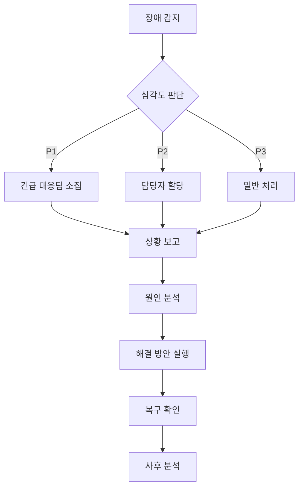

# 금융 데이터 분석 시스템 운영 매뉴얼

## 📊 시스템 모니터링

### 1. 핵심 메트릭 모니터링

```yaml
monitoring_metrics:
  system_health:
    - cpu_usage:
        warning: 70%
        critical: 85%
    - memory_usage:
        warning: 75%
        critical: 90%
    - disk_usage:
        warning: 80%
        critical: 90%

  application_metrics:
    - api_latency:
        p95_threshold: 500ms
        p99_threshold: 1000ms
    - error_rate:
        threshold: 0.1%
    - request_rate:
        min: 100/s
        max: 10000/s
```

### 2. 알림 설정

```yaml
alert_rules:
  high_priority:
    - condition: "error_rate > 1%"
      duration: "5m"
      channels:
        - slack: "#alerts-critical"
        - pagerduty: "trading-team"

  medium_priority:
    - condition: "api_latency_p95 > 500ms"
      duration: "10m"
      channels:
        - slack: "#alerts-warning"

  low_priority:
    - condition: "cpu_usage > 70%"
      duration: "15m"
      channels:
        - slack: "#alerts-info"
```

## 🔄 일상 운영 작업

### 1. 데이터베이스 관리

```sql
-- 일일 유지보수 쿼리
-- 1. 인덱스 재구축
REINDEX DATABASE trading_db;

-- 2. 통계 업데이트
ANALYZE VERBOSE;

-- 3. 오래된 데이터 아카이빙
INSERT INTO market_data_archive
SELECT * FROM market_data
WHERE timestamp < NOW() - INTERVAL '3 months';

DELETE FROM market_data
WHERE timestamp < NOW() - INTERVAL '3 months';
```

### 2. 로그 관리

```yaml
log_rotation:
  application_logs:
    retention: 30d
    max_size: 10GB
    compression: true

  system_logs:
    retention: 90d
    max_size: 50GB
    compression: true

  audit_logs:
    retention: 365d
    max_size: 100GB
    compression: true
    encryption: true
```

## 🚨 장애 대응

### 1. 장애 레벨 정의

```yaml
incident_levels:
  p1_critical:
    description: "서비스 완전 중단"
    response_time: "15분 이내"
    resolution_time: "2시간 이내"
    escalation:
      - devops_lead
      - system_architect
      - cto

  p2_major:
    description: "주요 기능 장애"
    response_time: "30분 이내"
    resolution_time: "4시간 이내"
    escalation:
      - devops_engineer
      - team_lead

  p3_minor:
    description: "부분 기능 장애"
    response_time: "2시간 이내"
    resolution_time: "8시간 이내"
    escalation:
      - on_call_engineer
```

### 2. 장애 대응 절차



## 💾 백업 및 복구

### 1. 백업 정책

```yaml
backup_policy:
  full_backup:
    schedule: "매주 일요일 01:00"
    retention: "4주"
    type: "스냅샷"

  incremental_backup:
    schedule: "매일 01:00"
    retention: "7일"
    type: "WAL"

  transaction_logs:
    archive: true
    retention: "30일"
```

### 2. 복구 절차

```bash
#!/bin/bash

# 1. 서비스 중지
kubectl scale deployment trading-api --replicas=0

# 2. 데이터베이스 복구
pg_restore -h $DB_HOST -U $DB_USER -d trading_db backup.dump

# 3. 데이터 정합성 검증
python verify_data_integrity.py

# 4. 서비스 재시작
kubectl scale deployment trading-api --replicas=3

# 5. 상태 확인
kubectl get pods -l app=trading-api
```

## 🔒 보안 관리

### 1. 접근 제어

```yaml
access_control:
  production:
    ssh_access:
      - role: admin
        auth: public_key + 2FA
      - role: developer
        auth: public_key + 2FA
        restrictions:
          - read_only
          - audit_logging

    kubernetes:
      - role: cluster-admin
        users: ["devops-lead"]
      - role: developer
        users: ["dev-team"]
        namespace: ["dev", "staging"]
```

### 2. 보안 점검

```yaml
security_checks:
  daily:
    - vulnerability_scan
    - auth_log_review
    - failed_login_attempts

  weekly:
    - dependency_updates
    - ssl_cert_check
    - firewall_rule_review

  monthly:
    - penetration_test
    - security_policy_review
    - access_right_audit
```

## 📈 성능 최적화

### 1. 캐시 관리

```yaml
cache_strategy:
  market_data:
    ttl: 60s
    max_size: 1GB
    eviction: LRU

  user_portfolio:
    ttl: 300s
    max_size: 500MB
    eviction: LFU

  trading_signals:
    ttl: 30s
    max_size: 200MB
    eviction: FIFO
```

### 2. 리소스 최적화

```yaml
resource_optimization:
  autoscaling:
    cpu_target: 70%
    memory_target: 75%
    min_replicas: 3
    max_replicas: 10

  pod_resources:
    requests:
      cpu: 1
      memory: 2Gi
    limits:
      cpu: 2
      memory: 4Gi
```

이 문서는 금융 데이터 분석 시스템의 운영 및 유지보수 가이드를 제공합니다. 시스템의 안정적인 운영을 위해 지속적으로 업데이트됩니다. 🚀
