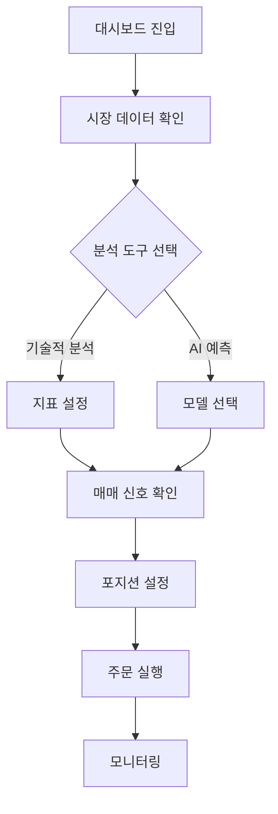
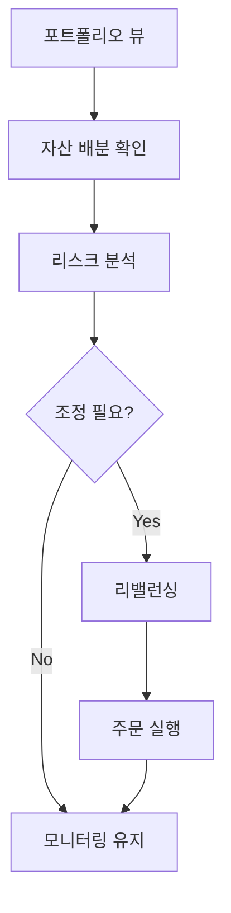

# 금융 데이터 분석 시스템 UI/UX 디자인 가이드

## 🎨 디자인 시스템

### 1. 색상 팔레트

```css
:root {
  /* 주요 색상 */
  --primary-100: #e3f2fd;
  --primary-500: #2196f3;
  --primary-900: #0d47a1;

  /* 보조 색상 */
  --secondary-100: #f3e5f5;
  --secondary-500: #9c27b0;
  --secondary-900: #4a148c;

  /* 상태 색상 */
  --success: #4caf50;
  --warning: #ffc107;
  --error: #f44336;
  --info: #2196f3;

  /* 중립 색상 */
  --neutral-100: #f5f5f5;
  --neutral-300: #e0e0e0;
  --neutral-500: #9e9e9e;
  --neutral-700: #616161;
  --neutral-900: #212121;
}
```

### 2. 타이포그래피

```css
:root {
  /* 폰트 패밀리 */
  --font-primary: "Inter", sans-serif;
  --font-secondary: "Roboto Mono", monospace;

  /* 폰트 크기 */
  --text-xs: 0.75rem; /* 12px */
  --text-sm: 0.875rem; /* 14px */
  --text-base: 1rem; /* 16px */
  --text-lg: 1.125rem; /* 18px */
  --text-xl: 1.25rem; /* 20px */
  --text-2xl: 1.5rem; /* 24px */

  /* 폰트 두께 */
  --font-light: 300;
  --font-regular: 400;
  --font-medium: 500;
  --font-bold: 700;
}
```

### 3. 그리드 시스템

```css
.container {
  display: grid;
  grid-template-columns: repeat(12, 1fr);
  gap: var(--spacing-4);

  @media (max-width: 768px) {
    grid-template-columns: repeat(4, 1fr);
  }
}
```

## 📱 컴포넌트 라이브러리

### 1. 차트 컴포넌트

#### 1.1 캔들스틱 차트

```typescript
interface CandlestickProps {
  data: {
    timestamp: string;
    open: number;
    high: number;
    low: number;
    close: number;
  }[];
  width?: number;
  height?: number;
  theme?: "light" | "dark";
}

const Candlestick: React.FC<CandlestickProps> = ({
  data,
  width = 800,
  height = 400,
  theme = "light",
}) => {
  // 차트 구현
};
```

#### 1.2 기술적 지표

```typescript
interface TechnicalIndicatorProps {
  type: "MA" | "RSI" | "MACD";
  data: number[];
  parameters: {
    period?: number;
    signal?: number;
  };
}
```

### 2. 대시보드 레이아웃

```typescript
interface DashboardLayoutProps {
  sidebar?: React.ReactNode;
  header?: React.ReactNode;
  main: React.ReactNode;
  footer?: React.ReactNode;
}

const DashboardLayout: React.FC<DashboardLayoutProps> = ({
  sidebar,
  header,
  main,
  footer,
}) => (
  <div className="dashboard-layout">
    {sidebar && <aside className="sidebar">{sidebar}</aside>}
    <div className="main-content">
      {header && <header className="header">{header}</header>}
      <main className="main">{main}</main>
      {footer && <footer className="footer">{footer}</footer>}
    </div>
  </div>
);
```

## 🔄 사용자 플로우

### 1. 트레이딩 플로우



### 2. 포트폴리오 관리



## 📐 반응형 디자인

### 1. 브레이크포인트

```scss
$breakpoints: (
  "mobile": 320px,
  "tablet": 768px,
  "desktop": 1024px,
  "wide": 1440px,
);

@mixin respond-to($breakpoint) {
  @if map-has-key($breakpoints, $breakpoint) {
    @media (min-width: map-get($breakpoints, $breakpoint)) {
      @content;
    }
  }
}
```

### 2. 레이아웃 조정

```scss
.trading-view {
  display: grid;
  gap: 1rem;

  @include respond-to("mobile") {
    grid-template-columns: 1fr;
  }

  @include respond-to("tablet") {
    grid-template-columns: repeat(2, 1fr);
  }

  @include respond-to("desktop") {
    grid-template-columns: repeat(3, 1fr);
  }
}
```

## ♿ 접근성

### 1. ARIA 레이블

```typescript
const PriceAlert: React.FC = () => (
  <div role="alert" aria-live="polite" aria-atomic="true">
    <span className="price-change">+5.23%</span>
  </div>
);
```

### 2. 키보드 네비게이션

```typescript
const TradingPanel: React.FC = () => {
  const handleKeyPress = (e: KeyboardEvent) => {
    switch (e.key) {
      case "ArrowUp":
        incrementPrice();
        break;
      case "ArrowDown":
        decrementPrice();
        break;
      case "Enter":
        submitOrder();
        break;
    }
  };

  return (
    <div
      tabIndex={0}
      onKeyDown={handleKeyPress}
      role="region"
      aria-label="거래 패널"
    >
      {/* 거래 패널 내용 */}
    </div>
  );
};
```

## 🎯 사용성 테스트

### 1. 테스트 시나리오

```typescript
const usabilityTests = [
  {
    name: "기본 거래 플로우",
    steps: [
      "대시보드 접속",
      "차트 분석",
      "주문 설정",
      "주문 실행",
      "결과 확인",
    ],
    success_criteria: [
      "3분 이내 완료",
      "오류 없는 실행",
      "사용자 만족도 4/5 이상",
    ],
  },
];
```

### 2. 피드백 수집

```typescript
interface UserFeedback {
  task: string;
  completion_time: number;
  error_count: number;
  satisfaction: number;
  comments: string;
}
```

이 문서는 금융 데이터 분석 시스템의 UI/UX 디자인 가이드를 제공합니다. 사용자 경험을 최적화하기 위해 지속적으로 업데이트되며, 피드백을 반영하여 개선됩니다. 🚀
