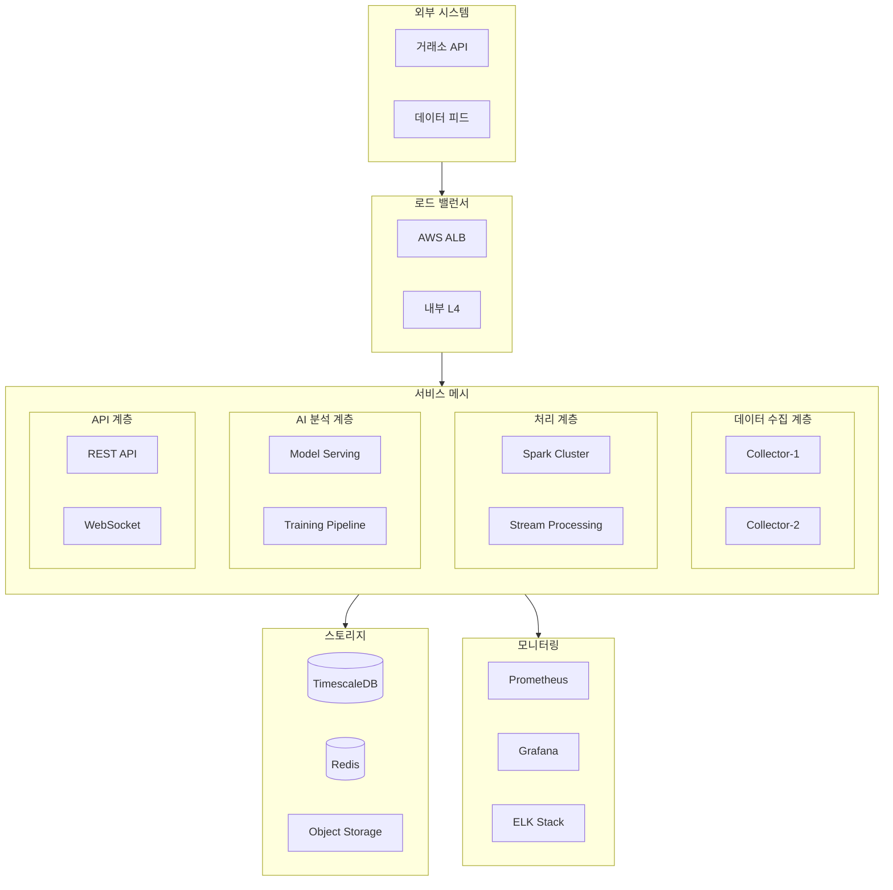

# 금융 데이터 분석 시스템 인프라 구성도

## 🏗️ 시스템 아키텍처

### 1. 전체 구성도



## 🌐 네트워크 구성

### 1. 네트워크 세그먼트

```plaintext
+------------------------+     +------------------------+
|     Public Subnet      |     |    Private Subnet      |
|------------------------|     |------------------------|
| - Load Balancer        |     | - Application Servers  |
| - Bastion Host         |     | - Database Clusters    |
| - NAT Gateway          |     | - Cache Servers        |
+------------------------+     +------------------------+
           |                              |
           |        VPC Peering           |
           +------------------------------+
```

### 2. 보안 그룹 설정

```yaml
security_groups:
  frontend:
    inbound:
      - port: 80
        source: 0.0.0.0/0
      - port: 443
        source: 0.0.0.0/0

  application:
    inbound:
      - port: 8080
        source: frontend_sg
      - port: 9000
        source: monitoring_sg

  database:
    inbound:
      - port: 5432
        source: application_sg
      - port: 6379
        source: application_sg
```

## 🚀 쿠버네티스 클러스터

### 1. 노드 구성

```yaml
node_pools:
  - name: general
    instance_type: c5.2xlarge
    min_size: 3
    max_size: 10
    labels:
      role: general

  - name: ai-inference
    instance_type: g4dn.xlarge
    min_size: 2
    max_size: 5
    labels:
      role: ai-inference

  - name: data-processing
    instance_type: r5.2xlarge
    min_size: 2
    max_size: 8
    labels:
      role: data-processing
```

### 2. 서비스 배포

```yaml
apiVersion: apps/v1
kind: Deployment
metadata:
  name: trading-api
spec:
  replicas: 3
  selector:
    matchLabels:
      app: trading-api
  template:
    metadata:
      labels:
        app: trading-api
    spec:
      containers:
        - name: trading-api
          image: trading-api:1.0.0
          resources:
            requests:
              cpu: 1
              memory: 2Gi
            limits:
              cpu: 2
              memory: 4Gi
```

## 📊 모니터링 시스템

### 1. 메트릭 수집

```yaml
prometheus:
  scrape_configs:
    - job_name: "kubernetes-pods"
      kubernetes_sd_configs:
        - role: pod
      relabel_configs:
        - source_labels: [__meta_kubernetes_pod_annotation_prometheus_io_scrape]
          action: keep
          regex: true

    - job_name: "trading-metrics"
      static_configs:
        - targets: ["trading-api:9090"]
```

### 2. 알림 설정

```yaml
alertmanager:
  config:
    route:
      receiver: "slack"
      group_wait: 30s
      group_interval: 5m
      repeat_interval: 4h

    receivers:
      - name: "slack"
        slack_configs:
          - channel: "#alerts"
            send_resolved: true
```

## 🔒 보안 설정

### 1. 네트워크 정책

```yaml
apiVersion: networking.k8s.io/v1
kind: NetworkPolicy
metadata:
  name: api-network-policy
spec:
  podSelector:
    matchLabels:
      app: trading-api
  policyTypes:
    - Ingress
    - Egress
  ingress:
    - from:
        - podSelector:
            matchLabels:
              role: frontend
      ports:
        - protocol: TCP
          port: 8080
```

### 2. 암호화 설정

```yaml
encryption:
  - resources:
      - secrets
    providers:
      - aescbc:
          keys:
            - name: key1
              secret: <base64-encoded-key>
      - identity: {}
```

## 🔄 스케일링 전략

### 1. 수평적 확장

```yaml
apiVersion: autoscaling/v2
kind: HorizontalPodAutoscaler
metadata:
  name: trading-api-hpa
spec:
  scaleTargetRef:
    apiVersion: apps/v1
    kind: Deployment
    name: trading-api
  minReplicas: 3
  maxReplicas: 10
  metrics:
    - type: Resource
      resource:
        name: cpu
        target:
          type: Utilization
          averageUtilization: 70
```

### 2. 수직적 확장

```yaml
apiVersion: autoscaling.k8s.io/v1
kind: VerticalPodAutoscaler
metadata:
  name: trading-api-vpa
spec:
  targetRef:
    apiVersion: apps/v1
    kind: Deployment
    name: trading-api
  updatePolicy:
    updateMode: Auto
```

## 🔧 운영 관리

### 1. 로깅 설정

```yaml
filebeat:
  inputs:
    - type: container
      paths:
        - /var/log/containers/*.log
      processors:
        - add_kubernetes_metadata:
            host: ${NODE_NAME}
            matchers:
              - logs_path:
                  logs_path: "/var/log/containers/"
```

### 2. 백업 정책

```yaml
backup:
  schedule: "0 1 * * *" # 매일 01:00
  retention:
    hourly: 24
    daily: 7
    weekly: 4
    monthly: 12
  storage:
    type: s3
    bucket: backup-bucket
    region: ap-northeast-2
```

이 문서는 금융 데이터 분석 시스템의 인프라 구성을 상세히 설명합니다. 시스템의 안정성과 확장성을 보장하기 위해 지속적으로 업데이트됩니다. 🚀
